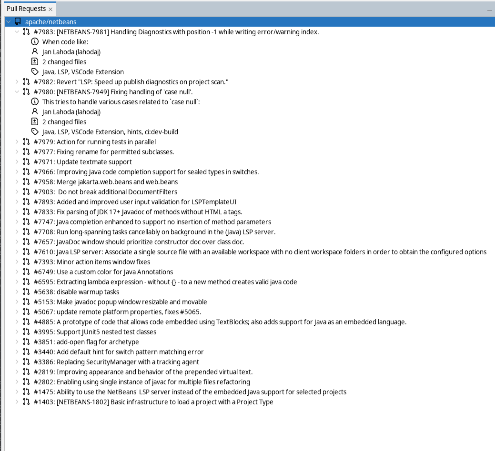
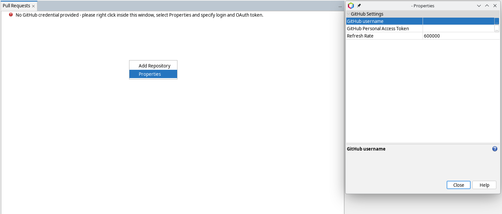
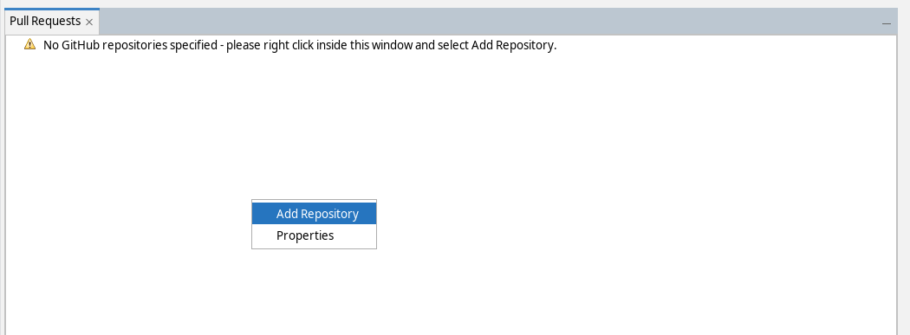
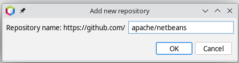
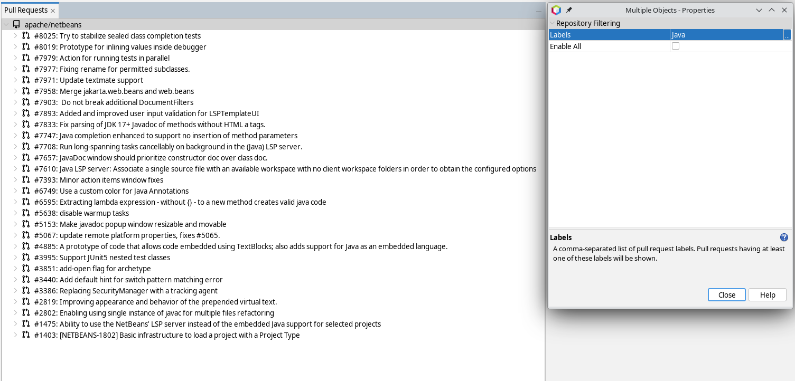

# Pull Requests in GitHub for NetBeans

Show open Pull Requests from GitHub directly inside the NetBeans IDE.

## Setup
To use the Pull Request view, a GitHub person access token is needed. The token
is needed to access the GitHub API. If only access to public repositories is
needed, the token does not need any specific permissions.

Create a new personal access token here:
https://github.com/settings/tokens

To setup in the IDE:

- open the _Pull Requests_ window (_Window/Pull Requests_)
- right-click on the empty place, and select _Properties_. A _Properties_ window will open. Fill in _GitHub username_ and _GitHub Personal Access Token_ (created above) in this window. Close the window.

- right-click on the empty place again, and select _Add Repository_. A window will open, fill in the repository name.

- by default, only open Pull Requests assigned to you will appear in the list. To change that, right-click on the repository, as select _Properties_. Then you can:
    - in _Labels_ specify a comma-separated list of Pull Request labels. Any open Pull Request with any of these labels will be shown under this repository
    - if _Enable All_ is specified, all Pull Requests for the given repository will be listed

## Acknowledgements

Inspired by an extension for Visual Studio Code: https://github.com/magicus/vscode-openjdk-devel

The following icons: file-diff-16, git-pull-request-16, info-16, person-16, repo-16, tag-16 are based on icons from this repository:
https://github.com/primer/octicons

The following icons: error.png, wait.gif, warning.png is from Apache NetBeans.
